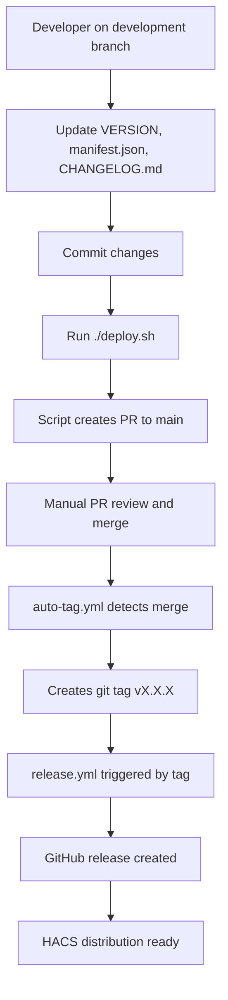

# Deployment Guide - Streamlined Release Process

## Overview

The Vacasa Home Assistant Integration uses a clean, streamlined deployment process with clear separation of responsibilities:
- **`deploy.sh`** - Simple script that creates release pull request
- **GitHub Actions** - Handle all automation after PR merge

## 🚀 Quick Start

```bash
# 1. Update version and changelog on development branch
# 2. Commit all changes
# 3. Create release pull request
./deploy.sh
# 4. Merge the PR when ready
# 5. GitHub Actions automatically create tag and release!
```

**Clean separation:** Script creates PR, GitHub Actions handle everything else automatically.

---

## 📋 Prerequisites

### Required Tools
- **Git** - Version control
- **GitHub CLI (gh)** - GitHub API access
- **Python 3.9+** - For version validation scripts

### Setup Instructions

1. **Install GitHub CLI**:
   ```bash
   # macOS
   brew install gh

   # Ubuntu/Debian
   sudo apt install gh

   # Windows
   winget install GitHub.CLI
   ```

2. **Authenticate with GitHub**:
   ```bash
   gh auth login
   ```

3. **Verify Prerequisites**:
   ```bash
   gh auth status
   git status
   ```

---

## 📦 Streamlined Release Process

### Step 1: Prepare Release on Development Branch

1. **Update Version Information**:
   ```bash
   # Update VERSION file
   echo "1.4.0" > VERSION

   # Update manifest.json version
   # Edit custom_components/vacasa/manifest.json
   ```

2. **Update CHANGELOG.md**:
   ```markdown
   ## [1.4.0] - 2025-XX-XX

   ### Added
   - New feature descriptions

   ### Fixed
   - Bug fix descriptions

   ### Changed
   - Change descriptions
   ```

3. **Commit Changes**:
   ```bash
   git add VERSION custom_components/vacasa/manifest.json CHANGELOG.md
   git commit -m "chore: prepare release v1.4.0"
   ```

### Step 2: Create Release Pull Request

```bash
./deploy.sh
```

**What the script does:**
- ✅ Validates prerequisites and version consistency
- ✅ Pushes development branch to GitHub
- ✅ Creates pull request from development to main
- ✅ Displays PR information and next steps

**What it does NOT do:**
- ❌ Merge the PR (manual step for safety)
- ❌ Create tags (handled by GitHub Actions)
- ❌ Create releases (handled by GitHub Actions)
- ❌ Monitor workflows (optional manual monitoring)

### Step 3: Merge PR (Manual Review)

1. **Review the PR** in GitHub web interface
2. **Ensure all CI checks pass**
3. **Merge the PR** when ready

### Step 4: Automated Release (GitHub Actions)

Once the PR merges to main, GitHub Actions automatically:

1. **Auto-Tag Workflow** (`auto-tag.yml`):
   - Detects release merge by commit message
   - Reads version from VERSION file and manifest.json
   - Creates annotated git tag with changelog content
   - Pushes tag to trigger release workflow

2. **Release Workflow** (`release.yml`):
   - Triggered by new git tag
   - Validates HACS requirements
   - Extracts changelog from CHANGELOG.md
   - Creates GitHub release with assets
   - Provides HACS distribution notification

---

## 🔄 Workflow Responsibilities

### `deploy.sh` Script
**Purpose**: Create release pull request only
- Prerequisites validation
- Version consistency checks
- Development branch push
- PR creation
- Information display

### `auto-tag.yml` Workflow
**Purpose**: Auto-create tags from main branch merges
- **Trigger**: Push to main branch
- **Detection**: Release merge pattern matching
- **Action**: Create git tag from VERSION file
- **Result**: Triggers release workflow

### `release.yml` Workflow
**Purpose**: Create GitHub release from git tags
- **Trigger**: New git tag (v*.*.*)
- **Validation**: HACS requirements only
- **Action**: Create GitHub release with changelog and assets
- **Result**: Production release ready for HACS

### `ci.yml` Workflow
**Purpose**: Continuous integration validation
- **Trigger**: Push/PR to main or development
- **Validation**: Tests, linting, security scans
- **Result**: Quality gate for all changes

---

## 🚨 Troubleshooting

### Common Issues

#### "GitHub CLI not authenticated"
```bash
gh auth login
gh auth status
```

#### "Working directory not clean"
```bash
git status
git add . && git commit -m "cleanup"
# or
git stash
```

#### "Version mismatch between files"
- Ensure VERSION file and manifest.json have the same version
- Check CHANGELOG.md has an entry for the new version

#### "PR creation failed"
- Check branch protection settings
- Verify GitHub CLI permissions
- Ensure development branch is ahead of main

#### "Auto-tag workflow didn't trigger"
- Check commit message contains "Release v" pattern
- Verify auto-tag.yml workflow is enabled
- Check GitHub Actions logs for errors

### Debug and Monitoring

```bash
# Monitor GitHub Actions
gh run list --limit 10

# View specific workflow
gh run view <run-id>

# Check current releases
gh release list

# View specific PR
gh pr view <pr-number>
```

---

## 🔧 Advanced Configuration

### Customizing the Script

Edit `deploy.sh` variables:
```bash
REQUIRED_BRANCH="development"  # Source branch
TARGET_BRANCH="main"           # Target branch
```

### Branch Protection Settings

Recommended GitHub branch protection for main:
- ✅ Require status checks to pass
- ✅ Require CI workflow completion
- ✅ Dismiss stale reviews when new commits are pushed
- ✅ Require conversation resolution before merging

### Workflow Customization

Modify workflows in `.github/workflows/`:
- `auto-tag.yml` - Adjust release detection patterns
- `release.yml` - Customize release asset creation
- `ci.yml` - Add/modify quality gates

---

## 📈 Best Practices

### Version Management
- Use semantic versioning (MAJOR.MINOR.PATCH)
- Update CHANGELOG.md before every release
- Keep VERSION file and manifest.json synchronized
- Test version changes locally first

### Release Cadence
- Release small, focused changes frequently
- Test on development branch thoroughly
- Monitor GitHub Actions for any issues
- Keep release notes comprehensive and user-friendly

### Quality Assurance
- All changes must pass CI before merge
- Manual PR review for release changes
- Monitor HACS integration after releases
- Track community feedback and issues

---

## 📚 Workflow Architecture



### Key Separation Points
- **Script responsibility ends** at PR creation
- **GitHub Actions responsibility starts** at main branch merge
- **No overlap or duplication** between components
- **Clear handoff points** for troubleshooting

---

## 📞 Getting Help

### Documentation
- **This guide** - Deployment process overview
- **README.md** - Integration features and usage
- **Memory Bank** - Detailed technical context
- **GitHub Issues** - Bug reports and feature requests

### Support Channels
- **GitHub Discussions** - General questions and community support
- **GitHub Issues** - Bug reports with deployment label
- **Code Review** - PR comments for deployment process improvements

For deployment-specific issues, please open a GitHub issue with the `deployment` label and include:
- Error messages from script or GitHub Actions
- Current branch and git status
- GitHub CLI authentication status
- Steps you followed before the error
