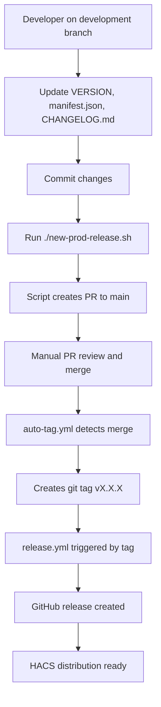

# Deployment Guide - Streamlined Release Process

## Overview

The Vacasa Home Assistant Integration uses a clean, streamlined deployment process with clear separation of responsibilities:
- **`new-prod-release.sh`** - Simple script that creates release pull request
- **GitHub Actions** - Handle all automation after PR merge

## 🚀 Quick Start

```bash
# 1. Update version and changelog on development branch
# 2. Commit all changes
# 3. Create release pull request
./new-prod-release.sh
# 4. Merge the PR when ready
# 5. GitHub Actions automatically create tag and release!
```

**Clean separation:** Script creates PR, GitHub Actions handle everything else automatically.

---

## 📋 Prerequisites

### Required Tools
- **Git** - Version control
- **GitHub CLI (gh)** - GitHub API access
- **Python 3.9+** - For version validation scripts

### Setup Instructions

1. **Install GitHub CLI**:
   ```bash
   # macOS
   brew install gh

   # Ubuntu/Debian
   sudo apt install gh

   # Windows
   winget install GitHub.CLI
   ```

2. **Authenticate with GitHub**:
   ```bash
   gh auth login
   ```

3. **Verify Prerequisites**:
   ```bash
   gh auth status
   git status
   ```

---

## 🔍 Pre-Release Branch Verification

**Always verify branch status before starting a release to avoid merge conflicts and workflow issues.**

### Check Branch Synchronization

```bash
# Fetch latest changes from remote
git fetch origin

# Check if development is behind main
git rev-list --left-right --count development...origin/main

# Output interpretation:
# "0	11" - development is 11 commits behind main (SYNC REQUIRED)
# "5	0"  - development is 5 commits ahead of main (OK to release)
# "5	3"  - development is 5 ahead, 3 behind (SYNC REQUIRED)
```

### Quick Status Check

```bash
# One-liner to check sync status
git fetch origin && git log --oneline development..origin/main

# If output is empty: branches are in sync ✅
# If commits are listed: development is behind main ⚠️
```

### Decision Matrix

| Scenario | Action Required |
|----------|----------------|
| Development is ahead of main | ✅ Proceed with release |
| Development equals main | ℹ️ No changes to release |
| Development is behind main | ⚠️ Sync required (see next section) |
| Development has diverged | ⚠️ Sync and resolve conflicts required |

---

## 🔄 Out-of-Sync Branch Recovery

When the development branch falls behind main (e.g., due to hotfixes or direct commits to main), follow these steps to sync:

### Detecting Out-of-Sync State

```bash
# Check how many commits development is behind
git fetch origin
git log --oneline development..origin/main
```

If commits are listed, your development branch is out of sync and needs to be updated.

### Syncing Development with Main

#### Option 1: Fast-Forward Merge (Preferred)

Use when development has no unique commits and just needs to catch up:

```bash
# Switch to development branch
git checkout development

# Merge main into development
git merge origin/main

# Push updated development
git push origin development
```

#### Option 2: Rebase (For Clean History)

Use when you want to replay development changes on top of main:

```bash
# Switch to development branch
git checkout development

# Rebase onto main
git rebase origin/main

# Push updated development (may require force push if already pushed)
git push origin development --force-with-lease
```

⚠️ **Warning:** Force push should only be used if you're certain no one else is working on the development branch.

#### Option 3: Merge Commit (For Collaboration)

Use when multiple people are working on development:

```bash
# Switch to development branch
git checkout development

# Create merge commit
git merge origin/main -m "chore: sync development with main"

# Push updated development
git push origin development
```

### Resolving Merge Conflicts

If conflicts occur during sync:

```bash
# View conflicted files
git status

# Edit conflicted files (marked with <<<<<<< ======= >>>>>>>)
# Remove conflict markers and keep desired changes

# Mark conflicts as resolved
git add <conflicted-files>

# Complete the merge
git merge --continue
# or for rebase
git rebase --continue

# Push changes
git push origin development
```

### Post-Sync Verification

```bash
# Verify branches are now in sync
git fetch origin
git log --oneline development..origin/main
# Should show no output if fully synced ✅
```

---

## 📦 Standard Release Process

Follow this checklist for regular releases when development is ahead of or in sync with main.

### Step 1: Prepare Release on Development Branch

**Version File Updates Checklist:**

- [ ] Update `VERSION` file with new version number
  ```bash
  echo "1.4.0" > VERSION
  ```

- [ ] Update `custom_components/vacasa/manifest.json` version field
  ```json
  {
    "version": "1.4.0",
    ...
  }
  ```

- [ ] Update `CHANGELOG.md` with release notes
  ```markdown
  ## [1.4.0] - 2025-XX-XX

  ### Added
  - New feature descriptions

  ### Fixed
  - Bug fix descriptions

  ### Changed
  - Change descriptions
  ```

- [ ] Commit all version changes together
  ```bash
  git add VERSION custom_components/vacasa/manifest.json CHANGELOG.md
  git commit -m "chore: prepare release v1.4.0"
  ```

### Step 2: Create Release Pull Request

```bash
./new-prod-release.sh
```

**What the script does:**
- ✅ Validates prerequisites and version consistency
- ✅ Pushes development branch to GitHub
- ✅ Creates pull request from development to main
- ✅ Displays PR information and next steps

**What it does NOT do:**
- ❌ Merge the PR (manual step for safety)
- ❌ Create tags (handled by GitHub Actions)
- ❌ Create releases (handled by GitHub Actions)

### Step 3: Review and Merge PR

- [ ] Review the PR in GitHub web interface
- [ ] Ensure all CI checks pass (tests, linting, security)
- [ ] Check for any last-minute issues or feedback
- [ ] Merge the PR when ready

### Step 4: Automated Release (GitHub Actions)

Once the PR merges to main, GitHub Actions automatically:

1. **Auto-Tag Workflow** (`auto-tag.yml`):
   - Detects release merge by commit message pattern
   - Reads version from VERSION file and manifest.json
   - Creates annotated git tag with changelog content
   - Pushes tag to trigger release workflow

2. **Release Workflow** (`release.yml`):
   - Triggered by new git tag
   - Validates HACS requirements
   - Extracts changelog from CHANGELOG.md
   - Creates GitHub release with assets
   - Notifies HACS of new distribution

---

## 🚨 Hotfix Release Process

Use this process for critical production bugs that need immediate release without waiting for development branch changes.

### When to Use Hotfix Process

- 🔥 Critical production bug affecting users
- 🔒 Security vulnerability requiring immediate patch
- 💥 Breaking issue in current release
- ⏰ Cannot wait for standard development cycle

### Hotfix Steps

#### 1. Create Hotfix Branch from Main

```bash
# Fetch latest main
git fetch origin
git checkout main
git pull origin main

# Create hotfix branch
git checkout -b hotfix/v1.4.1
```

#### 2. Implement and Test Fix

```bash
# Make necessary code changes
# ... edit files ...

# Test thoroughly
pytest
# ... manual testing ...

# Commit fix
git add .
git commit -m "fix: critical bug description"
```

#### 3. Update Version Files

```bash
# Increment patch version
echo "1.4.1" > VERSION

# Update manifest.json version
# Edit custom_components/vacasa/manifest.json

# Add hotfix entry to CHANGELOG.md
# Add under new [1.4.1] section
```

```bash
# Commit version changes
git add VERSION custom_components/vacasa/manifest.json CHANGELOG.md
git commit -m "chore: prepare hotfix release v1.4.1"
```

#### 4. Create Hotfix PR to Main

```bash
# Push hotfix branch
git push origin hotfix/v1.4.1

# Create PR to main
gh pr create --base main --head hotfix/v1.4.1 \
  --title "Hotfix v1.4.1: Critical bug fix" \
  --body "## Critical Hotfix

### Issue
Description of the critical issue

### Fix
Description of the fix applied

### Testing
How the fix was tested"
```

#### 5. Merge and Release

- [ ] Get expedited review and approval
- [ ] Merge hotfix PR to main
- [ ] Verify auto-tag workflow creates tag
- [ ] Verify release workflow creates GitHub release

#### 6. Sync Development Branch

**Critical:** After hotfix release, sync development with main to prevent future conflicts.

```bash
# Switch to development
git checkout development

# Merge main into development
git merge origin/main

# Resolve any conflicts if they occur
# ... resolve conflicts ...

# Push updated development
git push origin development
```

### Hotfix Best Practices

- ✅ Keep hotfix changes minimal - only fix the critical issue
- ✅ Test thoroughly before merging
- ✅ Update CHANGELOG.md with hotfix details
- ✅ Always sync development after hotfix release
- ✅ Consider if fix should be backported to other versions
- ❌ Don't include unrelated changes or features
- ❌ Don't skip version updates or changelog entries

---

## 🔄 Workflow Responsibilities

### `new-prod-release.sh` Script
**Purpose**: Create release pull request only
- Prerequisites validation
- Version consistency checks
- Development branch push
- PR creation
- Information display

### `auto-tag.yml` Workflow
**Purpose**: Auto-create tags from main branch merges
- **Trigger**: Push to main branch
- **Detection**: Release merge pattern matching
- **Action**: Create git tag from VERSION file
- **Result**: Triggers release workflow

### `release.yml` Workflow
**Purpose**: Create GitHub release from git tags
- **Trigger**: New git tag (v*.*.*)
- **Validation**: HACS requirements only
- **Action**: Create GitHub release with changelog and assets
- **Result**: Production release ready for HACS

### `ci.yml` Workflow
**Purpose**: Continuous integration validation
- **Trigger**: Push/PR to main or development
- **Validation**: Tests, linting, security scans
- **Result**: Quality gate for all changes

---

## 🚨 Troubleshooting

### Development Branch is Behind Main

**Symptom:** Script fails or warns that development is behind main

**Solution:**
```bash
# Check status
git fetch origin
git log --oneline development..origin/main

# Sync development with main
git checkout development
git merge origin/main
git push origin development

# Retry release
./new-prod-release.sh
```

See [Out-of-Sync Branch Recovery](#-out-of-sync-branch-recovery) for detailed steps.

### Merge Conflicts During Release

**Symptom:** PR shows conflicts that need resolution

**Solution:**
```bash
# On development branch
git fetch origin
git merge origin/main

# Resolve conflicts in editor
# Look for <<<<<<< ======= >>>>>>> markers

# Mark as resolved
git add <conflicted-files>
git commit -m "chore: resolve merge conflicts"
git push origin development

# PR will automatically update
```

### PR Creation Fails

**Symptom:** `gh pr create` command fails

**Common Causes & Solutions:**

1. **GitHub CLI not authenticated**
   ```bash
   gh auth login
   gh auth status
   ```

2. **Branch protection rules**
   - Check repository settings → Branches
   - Verify you have permission to create PRs
   - Ensure required checks are configured correctly

3. **Development not ahead of main**
   ```bash
   # Check branch status
   git log --oneline origin/main..development

   # If empty, no changes to release
   # Make changes on development first
   ```

4. **PR already exists**
   ```bash
   # Check existing PRs
   gh pr list

   # Close or merge existing PR first
   gh pr close <pr-number>
   ```

### Failed CI Checks

**Symptom:** PR shows failing status checks

**Solution:**

1. **Check which tests failed**
   ```bash
   gh pr checks <pr-number>
   ```

2. **Run tests locally**
   ```bash
   # Run full test suite
   pytest

   # Run linting
   ruff check .

   # Run type checking
   mypy custom_components/vacasa
   ```

3. **Fix issues and push**
   ```bash
   # Make fixes
   # ... edit files ...

   git add .
   git commit -m "fix: resolve CI issues"
   git push origin development
   ```

### Auto-Tag Workflow Didn't Trigger

**Symptom:** PR merged but no tag was created

**Common Causes:**

1. **Commit message doesn't match pattern**
   - Must contain "Release v" or "prepare release v"
   - Check `.github/workflows/auto-tag.yml` for pattern

2. **Workflow is disabled**
   ```bash
   # Check if workflow is enabled on GitHub
   # Go to Actions tab → Workflows → Auto-tag
   ```

3. **Workflow file has errors**
   ```bash
   # Check workflow logs
   gh run list --workflow=auto-tag.yml
   gh run view <run-id>
   ```

**Manual Recovery:**
```bash
# If auto-tag fails, create tag manually
git checkout main
git pull origin main
git tag -a v1.4.0 -m "Release v1.4.0"
git push origin v1.4.0
```

### Version Mismatch Between Files

**Symptom:** Script reports version inconsistency

**Solution:**
```bash
# Check current versions
cat VERSION
grep version custom_components/vacasa/manifest.json
grep "## \[" CHANGELOG.md | head -1

# Update all to match (e.g., 1.4.0)
echo "1.4.0" > VERSION
# Edit manifest.json version field
# Ensure CHANGELOG.md has [1.4.0] entry

# Commit corrected versions
git add VERSION custom_components/vacasa/manifest.json CHANGELOG.md
git commit -m "chore: fix version consistency"
```

### Working Directory Not Clean

**Symptom:** Script fails due to uncommitted changes

**Solution:**
```bash
# View changes
git status

# Option 1: Commit changes
git add .
git commit -m "chore: cleanup before release"

# Option 2: Stash changes temporarily
git stash
# ... run release script ...
git stash pop

# Option 3: Reset changes (careful!)
git reset --hard HEAD
```

### Debug and Monitoring

```bash
# Monitor GitHub Actions runs
gh run list --limit 10

# View specific workflow run
gh run view <run-id>

# Watch workflow in real-time
gh run watch <run-id>

# Check current releases
gh release list

# View specific PR
gh pr view <pr-number>

# Check PR status and checks
gh pr checks <pr-number>
```

---

## 🔧 Advanced Configuration

### Customizing the Script

Edit `new-prod-release.sh` variables:
```bash
REQUIRED_BRANCH="development"  # Source branch
TARGET_BRANCH="main"           # Target branch
```

### Branch Protection Settings

Recommended GitHub branch protection for main:
- ✅ Require status checks to pass
- ✅ Require CI workflow completion
- ✅ Dismiss stale reviews when new commits are pushed
- ✅ Require conversation resolution before merging

### Workflow Customization

Modify workflows in `.github/workflows/`:
- `auto-tag.yml` - Adjust release detection patterns
- `release.yml` - Customize release asset creation
- `ci.yml` - Add/modify quality gates

---

## 📈 Best Practices

### Version Management
- Use semantic versioning (MAJOR.MINOR.PATCH)
- Update CHANGELOG.md before every release
- Keep VERSION file and manifest.json synchronized
- Test version changes locally first

### Branch Management
- ✅ Keep development branch in sync with main regularly
- ✅ Run pre-release verification before creating PR
- ✅ Sync development immediately after hotfix releases
- ✅ Use descriptive commit messages for release commits
- ❌ Don't commit directly to main (except hotfixes)
- ❌ Don't force push to main or development without coordination

### Release Cadence
- Release small, focused changes frequently
- Test on development branch thoroughly
- Monitor GitHub Actions for any issues
- Keep release notes comprehensive and user-friendly
- Use hotfix process only for critical issues

### Quality Assurance
- All changes must pass CI before merge
- Manual PR review for release changes
- Monitor HACS integration after releases
- Track community feedback and issues

---

## 📚 Workflow Architecture



### Key Separation Points
- **Script responsibility ends** at PR creation
- **GitHub Actions responsibility starts** at main branch merge
- **No overlap or duplication** between components
- **Clear handoff points** for troubleshooting

---

## 📞 Getting Help

### Documentation
- **This guide** - Deployment process overview
- **README.md** - Integration features and usage
- **Memory Bank** - Detailed technical context
- **GitHub Issues** - Bug reports and feature requests

### Support Channels
- **GitHub Discussions** - General questions and community support
- **GitHub Issues** - Bug reports with deployment label
- **Code Review** - PR comments for deployment process improvements

For deployment-specific issues, please open a GitHub issue with the `deployment` label and include:
- Error messages from script or GitHub Actions
- Current branch and git status
- GitHub CLI authentication status
- Steps you followed before the error
